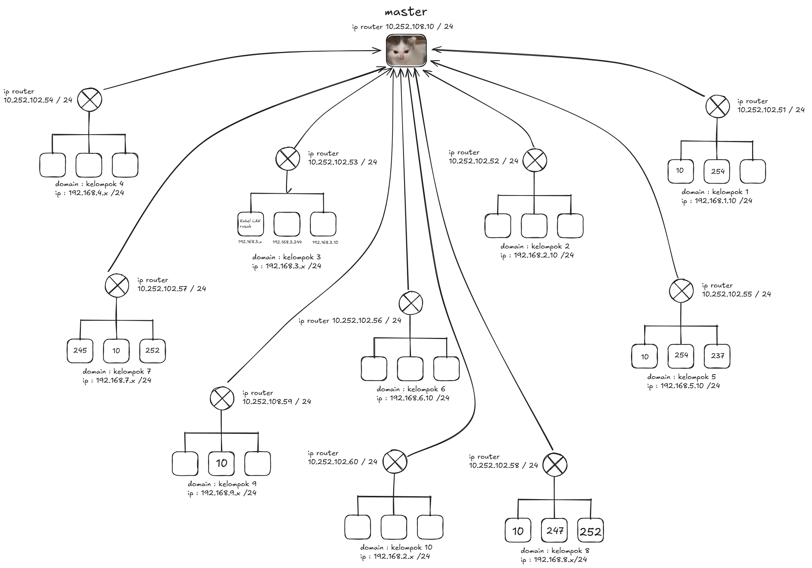
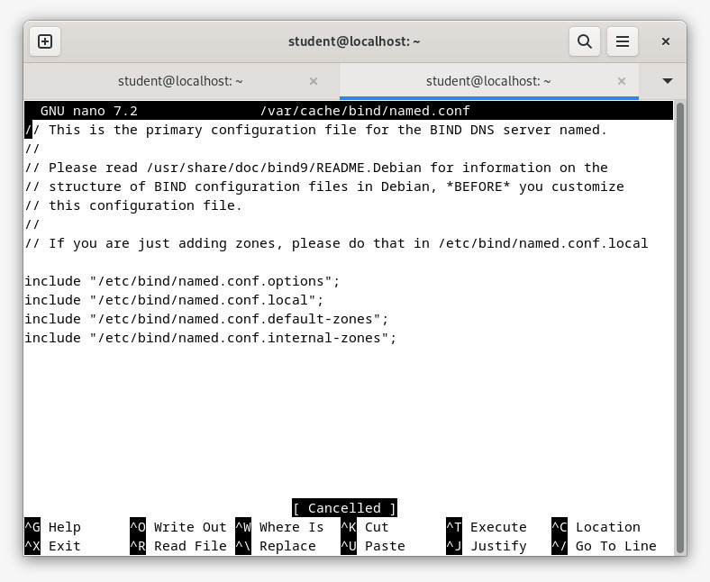
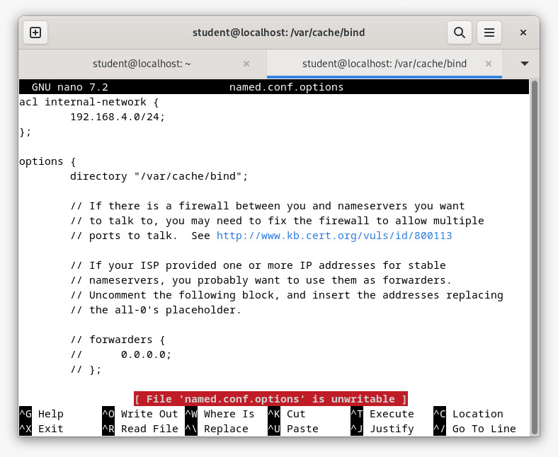
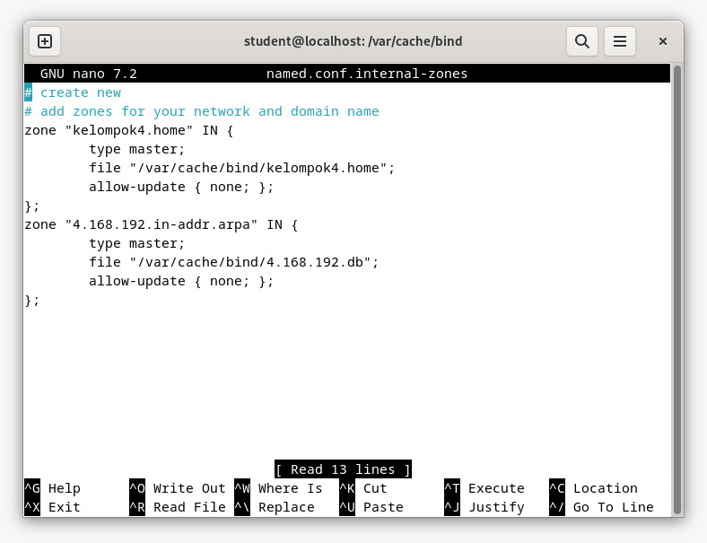
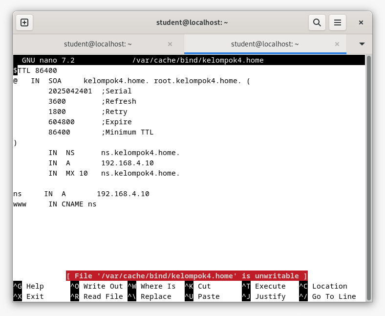
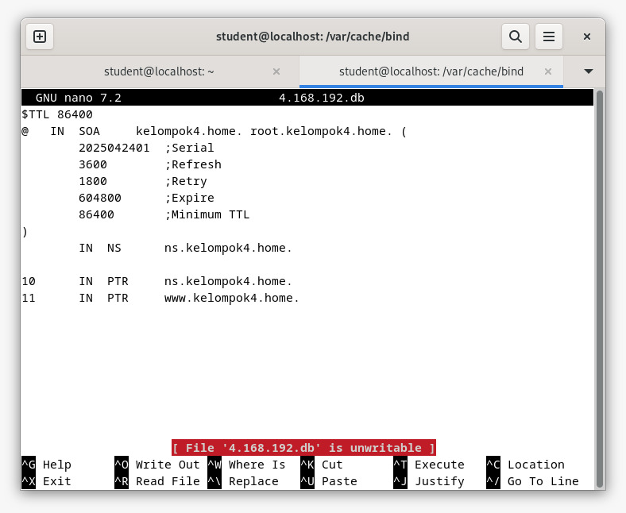
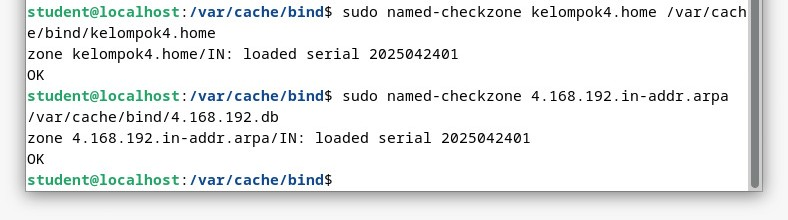
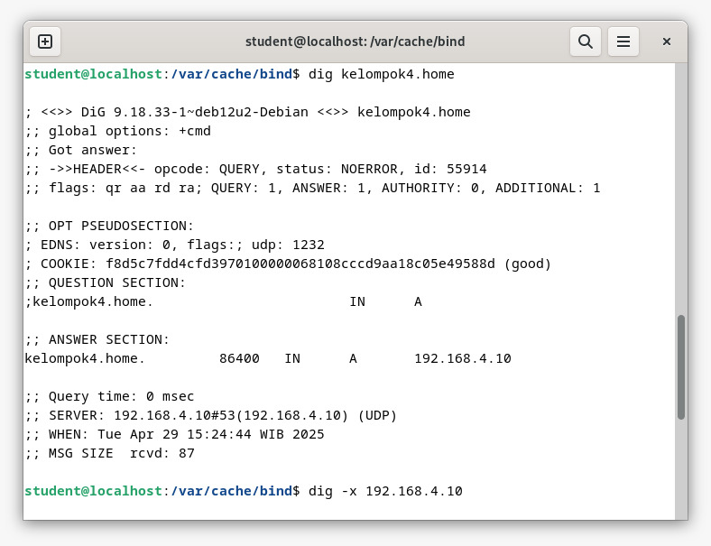
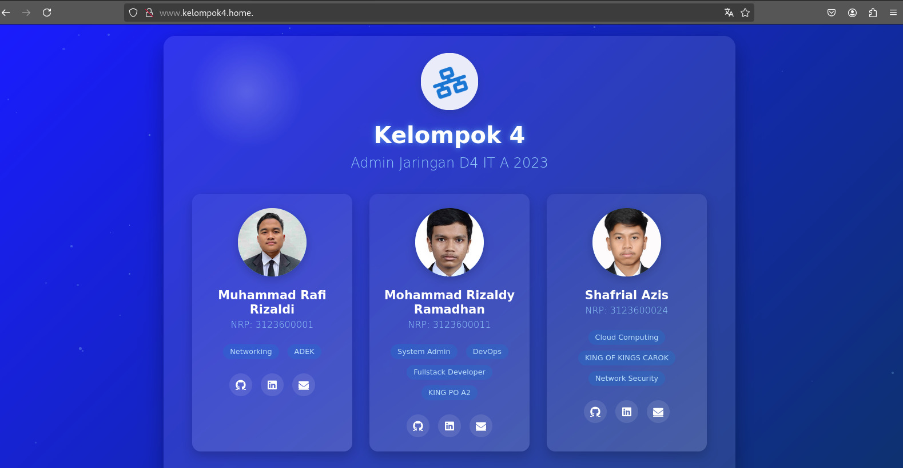
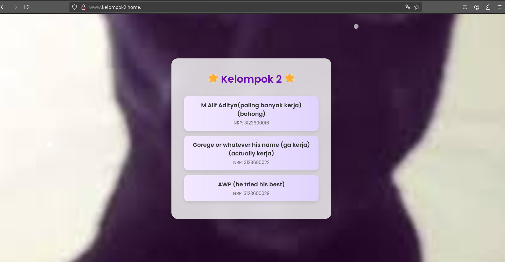

# DNS Server 

Mata Kuliah : Workshop Administrasi Jaringan

Dosen Pengampu : Dr. Ferry Astika Saputra ST, M.Sc

# Kelompok 4

Anggota :

1. M. Rafi Rizaldi (3123600001)

2. M. Rizaldy Ramadhan (3123600011)

3. Shafrial Azis (3123600024)

# Topologi



# Konfigurasi DNS
### 1. Mengunduh bind9 dan bind9utils 

```bash
apt -y install bind9 bind9utils;
```
### 2. Melakukan konfigurasi untuk named.conf 

```bash
nano /etc/bind/named.conf;
```


### 3. Melakukan konfigurasi untuk named.conf.options 

```bash
nano /etc/bind/named.conf.options;
```


### 3. Melakukan konfigurasi untuk named.conf.internal-zones 

```bash
nano /etc/bind/named.conf.internal-zones;
```

### 4. Melakukan konfigurasi untuk kelompok4.home 

```bash
nano /var/cache/bind/kelompok4.home;
```

### 5. Melakukan konfigurasi untuk 4.168.192.db 

```bash
nano /var/cache/bind/4.168.192.db;
```


### 6. Testing koneksi menggunakan named-checkzone 

```bash
named-checkzone kelompok4.home /var/cache/bind/kelompok4.home;
```
```bash
named-checkzone 4.168.192.in-addr-arpa /var/cache/bind/4.168.192;
```


### 7. Tes menggunakan dig 

```bash
dig kelompok4.home;
```
```bash
dig -x 192.168.4.10;
```


# Konfigurasi Web Server

### 1. Menginstal web server 

```bash
apt -y install apache2
```
### 2.Melakukan konfigurasi untuk tampilan web server 
```bash
nano /var/www/html/index.html
```
### 3.Restart web server

```bash
systemctl restart apache2
```
### 4.Akses web menggunakan browser
 - Lokal: 192.168.4.10



 - Klien lain: 192.168.2.10


