# Workshop Administrasi Jaringan  
**Tanggal**: 22 Maret 2025

## Nama Dosen Pengampu  
**Dr. Ferry Astika Saputra ST, M.Sc**

## Dikerjakan Oleh  
- **Nama**: Shafrial Azis  
- **NRP**: 3123600024  
- **Kelas**: 2 D4 IT A

---

## Minggu 8 – Konfigurasi VM 1

### 1. Mengunduh package `bind9` dan `bind9utils`  
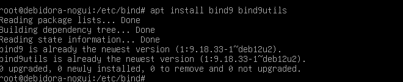

### 2. Mengunduh `iptables` dan `iptables-persistent`  
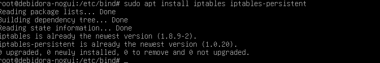

### 3. Konfigurasi `named.conf`  
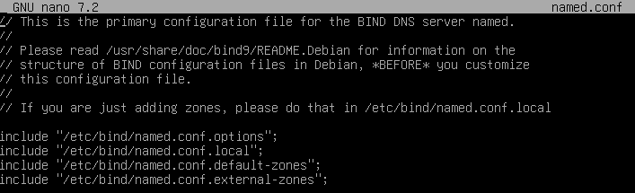

### 4. Konfigurasi `named.conf.options`  
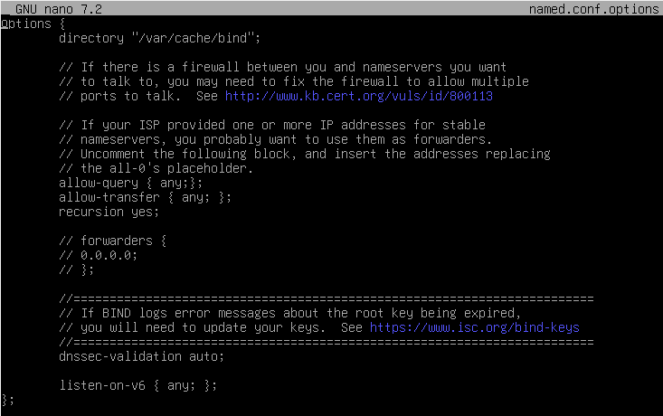

### 5. Konfigurasi `named.conf.external-zones`  
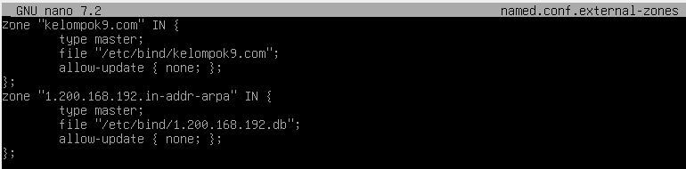

### 6. Konfigurasi `kelompok9.com`  
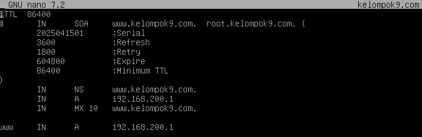

### 7. Konfigurasi `1.200.168.192.db`  
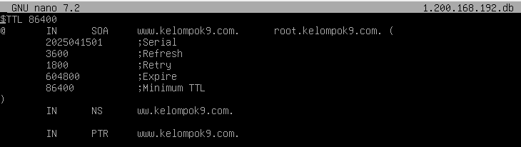

### 8. Pengecekan `named-checkzone` dan restart `named`  
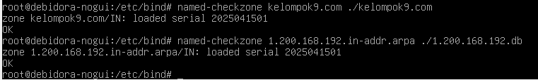  

### 9. Set `ip forward`  
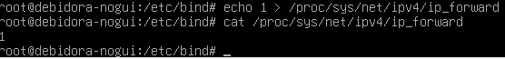

### 10. Konfigurasi `iptables`  
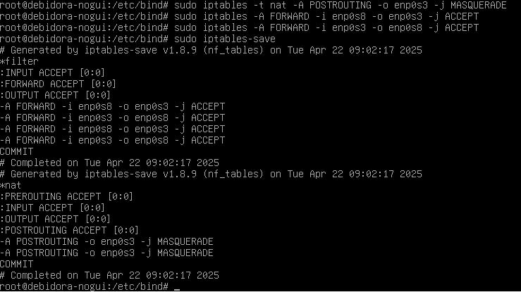

---

## Konfigurasi VM 2

### 1. Atur IP Address  
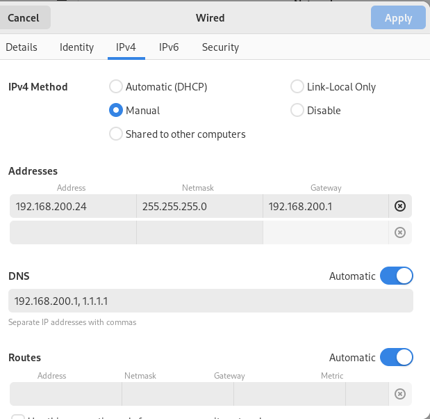

### 2. Ping ke VM 1  
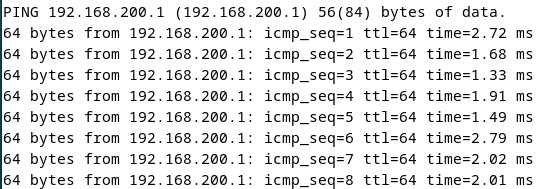

### 3. Cek DNS  
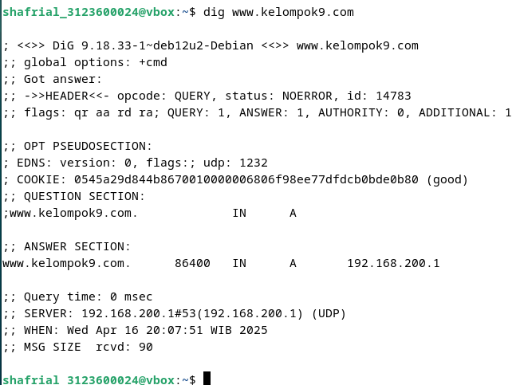  
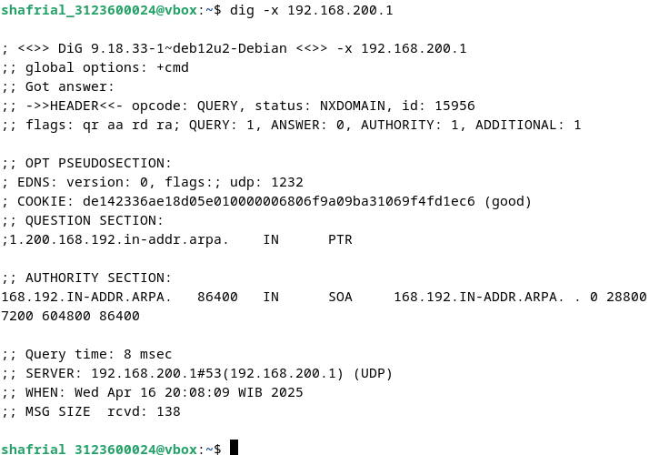  
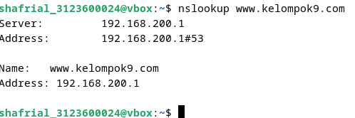

